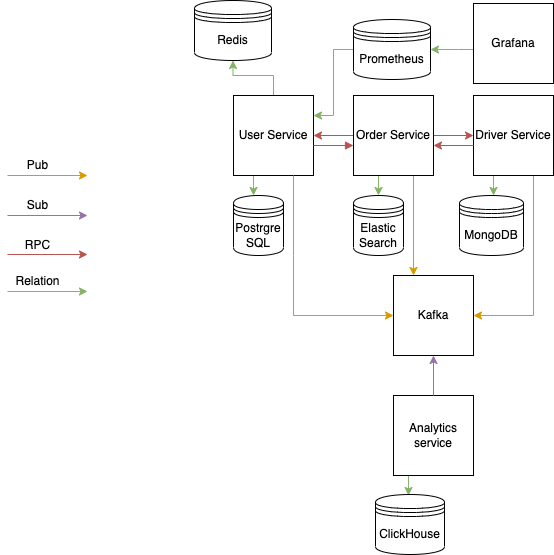

# InnoTaxi

All repositories, that are going to be created during the internship project must be private.
They become a part of the NDA, signed by you (**Forbidden to make those repos public, ever)!**

InnoTaxi - app for ordering a taxi.

In app realization, there must be:

3 user roles:
1) User;
2) Driver;
3) Analyst.

2 wallet types:
1) Pesonal;
2) Family;

3 taxi types:
1) Economy;
2) Comfort;
3) Business.

The app must be based on microservice architecture with clean architecture principles.

4 microservices must be created:

1) User Service;
2) Driver Service;
3) Order Service;
4) Analytic Service.

Detailed description of the services provided below.

Functional requirements:

User Service:
1) User can sign up. 
    * Fields for signing up: name, phone number, email, password.
2) User can sign in.
    * Fields for signing in: phone number, password.
3) User can log out of the app (token, that was given to user must become unacceptable by the system, even if it is still valid).
4) User can order a taxi.
    * Fields for ordering a taxi: taxi type, from, to.
    * While ordering a taxi, the system is seeking a free driver (status = free). When a driver is found, an order will be created with an in progress status. Driver becomes busy (status = busy).
    * If there are no available drivers, the user must wait for a free driver for some configurable amount of time. If after this time no driver is found, the user should receive a rejection response.
    * If no drivers are available, a queue of waiting users forms. The first user to order a taxi should be the first to receive a driver or a message that no driver has been found.
5) User can rate the trip. Only the last trip can be rated. Only the most recent trip can be rated if less than a certain (configurable) amount of time has elapsed since the trip. Rating from 1 to 5 inclusive.
   User can leave an optional comment for the trip.
6) User can view their trips (taxi type, driver, from, to).
7) User can view their profile (name, phone number, email, rating).
8) User can update their profile (name, phone number, email).
9) User can delete their profile (using soft delete).
10) User must have a wallet, also must be added the feature of creating a "family" wallet (wallet for many users), family wallet must be attached to the user's personal wallet, and the user can add new members to the family wallet by phone number.
11) If there are many wallets available for the User, User can choose which balance will be drained.
12) User can cash in their wallet. Family wallet can be cashed in only by its owner.
13) User can view their wallet's transactions. For family wallets, only the owner can see transactions.
14) User can't order a taxi if there isn't enough money in the chosen wallet.

Driver Service:
1) Driver can sign up.
    * Fields for signing up: name, phone number, email, password, taxi type.
2) Driver can sign in.
    * Fields for signing in: phone number, password.
3) Driver can change their status when the trip is over. At the same time, the order's status changes to finished.
4) Driver can rate the trip. Only the last trip can be rated. Only the most recent trip can be rated if less than a certain (configurable) amount of time has elapsed since the trip. Rating from 1 to 5 inclusive.
5) Driver can view their rating. Rating is calculated based on 20 previous trips.
6) Driver can view their trips (taxi type, user, from to).
7) Driver can have 2 statuses: busy, free.

Order Service:
1) Order Service acts as an orchestration  service for both User and Driver services. It is used for order processing. 
2) Order list is available for fetching with optional custom filters (any field).
3) Order fields: user, driver, from, to, taxi type, date, status, comment.
4) Orders' statuses could be in progress or finished.
5) Analyst has the ability to search through the list of orders.
6) Order Service stores prices for each of the taxi types.

Analytic Service:
1) Analyst can view the statistics of the orders (number by day, month).
2) Analyst can view the rating of all drivers.
3) Analyst can view the ratings of all users.
4) Analyst has a pre-created account in the system, login by username, password.
5) All registrations and completed orders should be recorded in Analytic database.

Applications schema:

 

Adding new services is allowed, it is not allowed to reduce the number of services. When you change the scheme (add new services), the application must be supplemented with a diagram and put in the repository in .png and .drawio formats. For each service you should create separate repository.

Nonfunctional requirements:

1) General:
- GitHub Flow.
- 2 main branches (main, dev).
- Main acts as a release branch. Only stable versions (with implemented functionality) should be uploaded here.
- When adding a new feature, refactoring, or fixing bugs, it is necessary to branch from the Dev branch and create a new one. Branch naming must include the Jira task ID.
- Do the work in the created branches and create a Pull Request in the Dev branch. The pull request's name must contain the Jira task ID .
- When the pull request is done, write to the mentor and start a new task without waiting for a revision. Work using the Jira flow described in the Onboarding Ticket.
- If mentor leaves some fix notes in PR's comments, you should fix them and commit to the same branch.
- When PR is approved, you should merge it to dev branch. Before merging, all commits must be squashed.
- All PRs for fronted must contain a proof of working part. Video can be accepted as a proof of work.

2) User service:
- PostgreSQL as DB.
- Tables: Users, Trips, Wallets, Transactions.
- Wallets table has MnM relation with Users table. There is as type column in Wallets table, it must be Enum. 2 types are allowed: Family, Personal.
- Inside PostgreSQL user's last 20 orders must be stored. In case of overflow of this amount trigger must be executed to clean old extra orders. 
- Based on the 20 ratings from the last orders, the user's average rating is formed.
- A table with all transactions to write off the balance. Transaction statuses: create, blocked, success and canceled. When the user creates an order, it is given **create** status, if the user's balance >= the cost of the trip, the status changes to **blocked**, otherwise to **canceled**. When the trip is completed, the status is switched to **success**.
- Redis as a cache. Implement user token storage and logout (token deletion).
- Prometheus and Grafana for collecting metrics.
- Swagger is generated from the application code.
- Front-end: Use Vue.js (3.0) composition API. Create a registration form, an authorization form, view your profile, change fields in your profile, delete your profile. Use components, Pinia.
- VCS: GitHub; CI/CD: Github Actions.

3) Driver service:
- Handler layer must be generated from a Swagger file. (No handmade HTTP interaction).
- MongoDB as DB.
- The database stores: information about the Driver (name, phone number, email, password, taxi type), information about the last 20 orders, driver's rating as an array, driver's balance (earnings). When the length of the array with orders becomes >20, it is necessary to delete the irrelevant ones.
- Aggregation of the driver rating based on the last 20 ratings.
- Pprof handlers must be added (and used). Or another type of profiling if GO is not used.
- Within profiling use PGO to optimize your service. First try it with Pprof, then with some other profiler (your choice).
- Front-end: Use Angular (latest version), create registration forms, authorization, and profile views, change fields in profile, and delete profile.
- VCS: Gitlab; CI/CD: Gitlab CI/CD;

4) Order service:
- GraphQL as a transport layer.
- Endpoint to search by fields: DriverID, UserID, from, to, fromDate, toDate. Implement partial search (when some fields are not specified, they should be ignored).
- Add pagination for the given endpoint. Fields offset; limit.
- Elasticsearch for order service (ability to search **from** or **to** created trips). Search by prefix, full text search by trip comments, and add the possibility of searching with transliteration and lexical errors.
- Additional task: to implement the possibility of selecting drivers based on user rating.
- Front-end: Use React + redux/redux toolkit. Create a main page (front to GQL endpoints) with filters (from - to; fromDate - toDate; User name; Driver name; taxi type etc.).
- VCS: BitBucket; CI/CD: Bitbucket pipelines.

5) Analyst service:
- ClickHouse as DB.
- Consume messages from Kafka into ClickHouse.
- VCS: Github; CI/CD: Circle CI.

Technical requirements:
- Kafka as a message broker.
- For RPC interactions, use GRPC.
- A Dockerfile must be described for each service.
- Each service must contain a Makefile to test, build, and deploy the service.
- The entire infrastructure must be deployed in two environments: Docker via docker-compose and Kubernetes via Helm.
- All variables to be changed (database connection, user's waiting time) must be set via environment variables.
- Each service must have a README (describing what is needed to start it and environment variables) and a swagger (detailing all the endpoints).
- All services must be covered by integration tests and Unit tests.
- A CI/CD must be set up for each service with the following steps: 1) tests, 2) linter, 3) linter for protofiles, 4) vulncheck, 5) Build the image and upload it to your Docker Hub (in the master branch).
- Authentication using JWT.
- For each service there should be created Postman collections and Postman tests.

  Go:
- UserService: Gin as an HTTP-library. Analyst: Fiber.
- Usage of golangci-lint
- To work with Postgres it is allowed to use pure SQL, or sqlc, sqlx, or squirrel. Using ORM is not allowed.
- To implement the user's waiting for free drivers, use goroutines and channels, and if necessary, sync and x/sync packages.
- For migrations use Goose or go-migrate.
- Style guidlines [here](https://rakyll.org/style-packages/)
- To use table tests, gomock, testify/suite, ginkgo, gomega.
- For integration tests, use dockertest.
